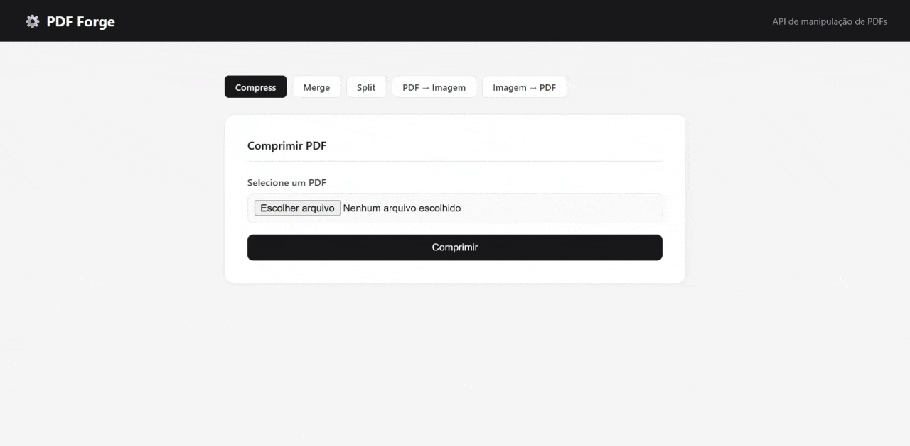
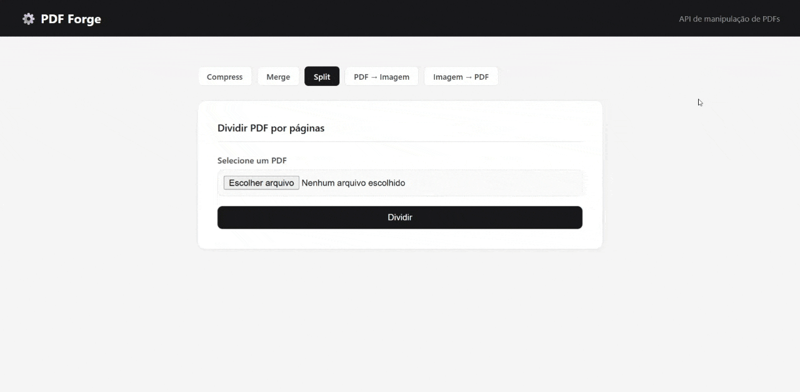
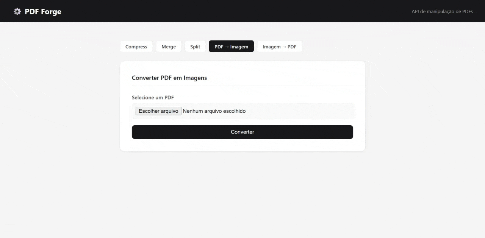

# ⚙️ PDF Forge

> API REST para manipulação de arquivos PDF — construída com Laravel 13, MySQL e processamento assíncrono com Jobs e Queues.



## 📋 Sobre o projeto

O **PDF Forge** é uma API de manipulação de PDFs inspirada no iLovePDF. O projeto foi desenvolvido como portfólio para demonstrar conhecimentos em arquitetura de APIs REST, processamento assíncrono e boas práticas de desenvolvimento back-end com Laravel.

O sistema recebe arquivos via upload, enfileira o processamento em background e notifica o resultado via polling de status — exatamente como sistemas reais de processamento de arquivos funcionam.

## ✨ Funcionalidades

| Operação | Descrição |
|---|---|
| **Comprimir PDF** | Reduz o tamanho do arquivo mantendo qualidade |
| **Unir PDFs** | Combina dois ou mais PDFs em um único arquivo |
| **Dividir PDF** | Extrai cada página em um arquivo separado (download em ZIP) |
| **PDF → Imagem** | Converte cada página do PDF em imagem JPG (download em ZIP) |
| **Imagem → PDF** | Converte imagens JPG/PNG em um arquivo PDF |

## 🛠️ Tecnologias utilizadas

- **PHP 8.5** + **Laravel 13**
- **MySQL** — banco de dados relacional
- **Laravel Queues** — processamento assíncrono de arquivos
- **Ghostscript 10** — motor de manipulação de PDF
- **FPDI / FPDF** — geração e leitura de PDFs via PHP
- **Blade** — interface simples para teste da API
- **Postman** — testes de endpoints durante desenvolvimento

## 🏗️ Arquitetura

```
app/
├── Http/
│   ├── Controllers/
│   │   └── PdfController.php      # Recebe requisições e despacha jobs
│   └── Requests/
│       └── UploadPdfRequest.php   # Validação de arquivos e operações
├── Jobs/
│   └── ProcessPdfJob.php          # Processamento assíncrono em background
├── Services/
│   └── PdfService.php             # Lógica de negócio — manipulação de PDFs
└── Models/
    └── PdfTask.php                # Rastreamento de cada operação
```

**Fluxo de uma requisição:**

```
Upload → Validação → Controller → Job despachado → Resposta 202
                                        ↓
                                   Worker processa
                                        ↓
                                   Banco atualizado (done/failed)
                                        ↓
                                   Cliente faz polling → Download
```

## 🧠 Decisões técnicas

### Por que Jobs e Queues?
Arquivos PDF podem ser grandes e o processamento (especialmente split e conversão) pode levar vários segundos. Processar de forma síncrona travaria o servidor para outros usuários. Com filas, o servidor responde imediatamente com `202 Accepted` e processa em background.

### Por que Ghostscript em vez de bibliotecas PHP puras?
Bibliotecas PHP como FPDI têm limitações com PDFs modernos (compressão de streams não suportada na versão gratuita). O Ghostscript é um motor maduro, usado em produção por grandes empresas, que suporta qualquer versão de PDF sem restrições.

### Por que separar Service e Controller?
O Controller não sabe *como* comprimir um PDF — ele só sabe que precisa pedir para alguém fazer. Quem sabe é o `PdfService`. Isso segue o princípio da responsabilidade única: cada classe tem um papel claro, facilitando manutenção.

### Por que registrar cada operação no banco?
A tabela `pdf_tasks` funciona como um log de auditoria. Cada operação tem status (`pending`, `processing`, `done`, `failed`) e mensagem de erro quando aplicável. Isso permite rastrear falhas, reprocessar jobs e futuramente implementar histórico por usuário.

## 🚀 Como rodar localmente

### Pré-requisitos

- PHP 8.2+
- Composer
- MySQL
- [Ghostscript](https://ghostscript.com/releases/gsdnld.html) instalado e no PATH do sistema
- Extensão `zip` habilitada no `php.ini`

### Instalação

```bash
# 1. Clone o repositório
git clone https://github.com/felipekauan1/pdf-forge.git
cd pdf-forge

# 2. Instale as dependências
composer install

# 3. Configure o ambiente
cp .env.example .env
php artisan key:generate

# 4. Configure o banco de dados no .env
DB_DATABASE=pdf_forge
DB_USERNAME=root
DB_PASSWORD=sua_senha

# 5. Crie o banco e rode as migrations
php artisan migrate

# 6. Configure a fila no .env
QUEUE_CONNECTION=database
```

### Rodando o projeto

Você precisará de **dois terminais abertos simultaneamente**:

```bash
# Terminal 1 — servidor
php artisan serve

# Terminal 2 — worker de filas (obrigatório para processar os PDFs)
php artisan queue:work
```

Acesse `http://localhost:8000` no navegador.

## 📡 Endpoints da API

### Upload e processamento
```
POST /api/pdf/upload
Content-Type: multipart/form-data

Campos:
  files[0]    file    Arquivo PDF ou imagem
  files[1]    file    Segundo arquivo (obrigatório apenas para merge)
  operation   string  compress | merge | split | pdf_to_image | image_to_pdf
```

**Resposta (202):**
```json
{
    "message": "Arquivo recebido. Processando em background.",
    "task_id": 1,
    "status": "pending"
}
```

### Consultar status
```
GET /api/pdf/status/{task_id}
```

**Resposta:**
```json
{
    "task_id": 1,
    "operation": "compress",
    "status": "done",
    "result_path": "processed/compressed_abc123.pdf",
    "error": null
}
```

**Status possíveis:** `pending` → `processing` → `done` | `failed`

### Download do resultado
```
GET /api/pdf/download/{task_id}
```

Retorna o arquivo processado para download.
Para operações com múltiplos arquivos (`split`, `pdf_to_image`), retorna um `.zip`.

## 📸 Screenshots





## 📌 Possíveis melhorias futuras

- Autenticação com Laravel Sanctum e histórico por usuário
- Suporte a múltiplas imagens no `image_to_pdf`
- Limpeza automática de arquivos processados (scheduled jobs)
- Deploy com Docker + Supervisor para produção
- Testes automatizados com PHPUnit

## 👨‍💻 Autor

Desenvolvido por **[@felipekauan1](https://github.com/felipekauan1)**

## 📄 Licença

Este projeto está sob a licença MIT.
